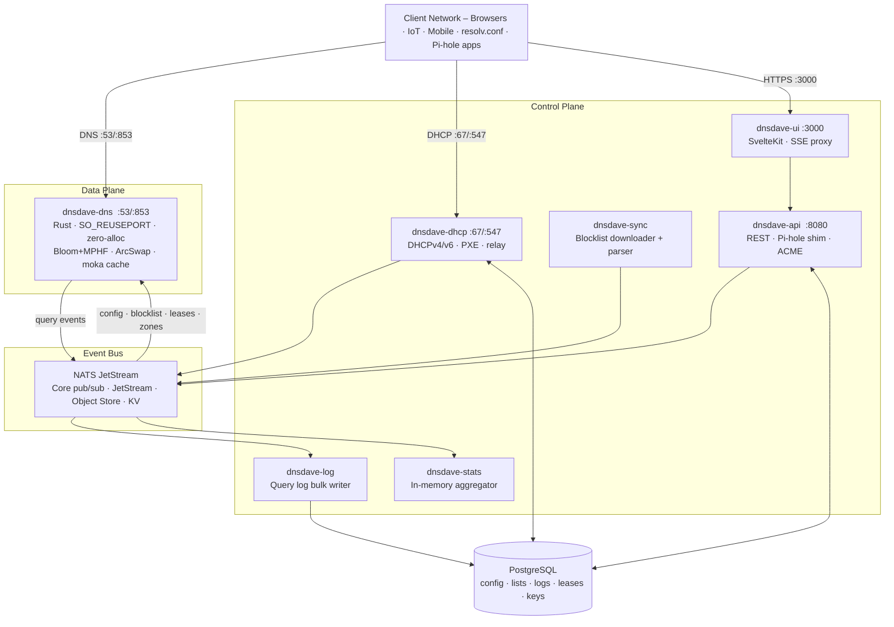

# dnsdave

> **Status: Design complete – implementation in progress.**  
> All architecture, APIs, and tests are fully specified. Code is not yet written.

[](LICENSE)
[](#platform-support)
[](https://www.rust-lang.org)
[](UI.md)

**DNSDave** is an API-first, event-driven DNS + DHCP server designed for private networks – from a Raspberry Pi on your desk to a multi-node Kubernetes cluster. It blocks ads and telemetry at the DNS layer, manages DHCP leases with full RFC option support, acts as the authoritative DNS server for your local zones, and exposes every function through a stable REST API and a real-time web UI.

It was built to fill the gap between **Pi-hole** (excellent filtering, limited management) and **Infoblox** (complete DDI, enterprise price tag): production-grade DNS infrastructure that a developer or small ops team can operate without becoming DNS experts.

---

## Why DNSDave?

| | Pi-hole | AdGuard Home | DNSDave |
|-|:-------:|:------------:|:-------:|
| Ad blocking & per-group policy | ✅ | ✅ | ✅ |
| Pi-hole API compatibility | ✅ | ❌ | ✅ |
| Authoritative local DNS zones | ❌ | ❌ | ✅ |
| AXFR / IXFR / RFC 2136 DNS UPDATE | ❌ | ❌ | ✅ |
| Full DHCPv4/v6 + PXE + relay | ❌ | 🟡 | ✅ |
| DoH / DoT server | ❌ | ✅ | ✅ |
| DNSSEC validation + signing | 🟡 | 🟡 | ✅ |
| REST API with OpenAPI spec | 🟡 | 🟡 | ✅ |
| Real-time SSE streams | ✅ | ✅ | ✅ |
| Horizontal DNS scaling (N nodes) | ❌ | ❌ | ✅ |
| Kubernetes / Helm native | ❌ | ❌ | ✅ |
| `linux/arm64` + `arm/v7` + `amd64` | ✅ | ✅ | ✅ |
| >500K QPS on a 4-core host | ❌ | ❌ | ✅ |

See [`COMPARISON.md`](COMPARISON.md) for a full comparison against Pi-hole, AdGuard Home, Technitium, dnsmasq, CoreDNS, BIND9, PowerDNS, and Infoblox.

---

## Feature Highlights

### DNS
- **Forwarding resolver** with DoH and DoT upstreams, HTTP/2 connection pooling, and upstream health checks
- **Authoritative zones** – SOA, NS, AXFR, IXFR, RFC 1996 NOTIFY, RFC 2136 DNS UPDATE; `home.arpa` template built-in
- **Wildcard DNS** (`*.apps.home.arpa`) with longest-suffix-wins label trie
- **Conditional forwarding** – route specific domains to specific resolvers (VPN, Consul, corporate DNS), bypassing the blocklist
- **Split-horizon views** – different answers for different client groups
- **DNSSEC validation** (strict / opportunistic / off) with AD bit; **DNSSEC zone signing** with Ed25519 / ECDSA keys, NSEC3, automated ZSK rollover

### Blocklist & Filtering
- Ingests **Pi-hole gravity**, domain-only, AdBlock Plus, and RPZ formats
- **Bloom filter + Minimal Perfect Hash Function** two-stage lookup – sub-microsecond blocked-domain response, ~130 MB for 5M domains
- **Incremental sync** with hot-swap: new blocklist goes live in seconds with zero query downtime
- Per-client / per-group policies; allowlist always wins

### DHCP
- **DHCPv4 + DHCPv6** (DORA + SARR state machines)
- Full RFC option suite (codes 1–252 + custom); global → scope → reservation option hierarchy
- **PXE boot** with automatic BIOS/UEFI architecture detection (option 93)
- **DHCP relay** (RFC 3046, giaddr + option 82)
- **Vendor / client class** matching
- **Automatic dynamic DNS** registration (A + AAAA + PTR) on every lease assignment via NATS – no polling

### Certificates
- **Self-signed bootstrap** via `rcgen` on first start – HTTPS works with zero configuration
- **ACME (Let's Encrypt)** auto-provisioning using DNS-01 over its own RFC 2136 interface – no port 80 required
- **ACME DNS-01 helper** for any other service in your network (`certbot --dns-rfc2136` against DNSDave's zone)
- **TLS hot-reload** across all containers on cert renewal – no restarts

### Architecture
- **Event-driven via NATS JetStream** – the DNS hot path fires non-blocking NATS publishes; logging, stats, and DHCP DDNS are downstream consumers
- **Stateless DNS data plane** – each `dnsdave-dns` node derives its full runtime state from NATS on startup; scale horizontally by adding nodes
- **`SO_REUSEPORT` + `recvmmsg`/`sendmmsg`** – one Tokio task per CPU core, batch UDP I/O
- **Lock-free ArcSwap structures** – blocklist, zone trie, forward zone table, and allowlist all hot-swap via atomic pointer swap with no query-path locking
- **GC-free** – written in Rust; no garbage collector pauses on the hot path
- **Pluggable observability export** – `dnsdave-export` subscribes to NATS and pushes events to any external system: syslog (rsyslog), Grafana Loki, ELK / Logstash, Splunk, InfluxDB, StatsD, Datadog, or generic HTTP webhook – zero changes to existing containers required

---

## Architecture Overview



---

## Quick Start

### Raspberry Pi / Home Server

```bash
# Clone and configure
git clone https://github.com/my0373/dnsdave.git
cd dnsdave
cp .env.example .env          # set POSTGRES_PASSWORD, DNSDAVE_API_KEY

# Start the full stack
docker compose up -d

# UI is available at http://<host>:3000
# DNS is on port 53 – point your router's DNS to this host
# DHCP is on port 67 – configure in the UI
```

**Point your devices at DNSDave:** set your router's DHCP option 6 (DNS server) to the IP of your DNSDave host, or configure DNSDave's own DHCP server to hand out its address.

### Raspberry Pi 3 (1 GB RAM) – Minimal Profile

```bash
docker compose -f docker-compose.minimal.yml up -d
# Uses SQLite, no dnsdave-log/stats, reduced cache – ~300 MB RSS
```

### Kubernetes

```bash
helm repo add dnsdave https://charts.dnsdave.io
helm install dnsdave dnsdave/dnsdave \
  --namespace dnsdave --create-namespace \
  --set api.key="<your-key>"
```

### macOS Development

```bash
# No Docker needed – runs natively (recv_from/send_to fallback for :53)
cargo run --bin dnsdave-dns -- --config config/dev.toml
cargo run --bin dnsdave-api -- --config config/dev.toml
```

---

## Platform Support

| Platform | Target | Hardware |
|----------|--------|----------|
| `linux/amd64` | `x86_64-unknown-linux-gnu` | Servers, VMs, x86 desktops |
| `linux/arm64` | `aarch64-unknown-linux-gnu` | **Raspberry Pi 3/4/5** (64-bit OS), Apple Silicon, AWS Graviton |
| `linux/arm/v7` | `armv7-unknown-linux-gnueabihf` | **Raspberry Pi 3+** (32-bit OS) |
| `macOS/arm64` | `aarch64-apple-darwin` | Apple Silicon (M1/M2/M3/M4) – dev only |
| `macOS/x86_64` | `x86_64-apple-darwin` | Intel Mac – dev only |

All container images are published as **multi-arch manifests** – `docker pull` resolves the correct variant automatically. No build flags needed.

---

## Documentation

| Document | Description |
|----------|-------------|
| [`DESIGN.md`](DESIGN.md) | Full architecture and product design – goals, event bus, performance architecture, DNS features, DHCP, DNSSEC, certificates, API design, data model, deployment, observability, security, milestones, technology choices |
| [`UI.md`](UI.md) | Web UI design specification – design system, all 12 pages, component catalogue, SSE data layer, responsive design, accessibility, keyboard shortcuts, API integration map |
| [`TESTS.md`](TESTS.md) | Test specification – 150+ named unit, integration, and load tests across all components; milestone test gates; regression policy |
| [`COMPARISON.md`](COMPARISON.md) | Competitive comparison against Pi-hole, AdGuard Home, Technitium, dnsmasq, CoreDNS, BIND9, PowerDNS, and Infoblox across 13 feature categories |
| [`LIMITATIONS.md`](LIMITATIONS.md) | Frank account of what DNSDave does not do, will never do, and does differently – with specific comparisons against Pi-hole and major DDI solutions |

---

## Performance Targets

| Metric | Target |
|--------|--------|
| Throughput (blocked / cached queries) | **>500,000 QPS** on a 4-core host |
| p50 latency (any query) | **<0.5 ms** |
| p99 latency (any query) | **<1 ms** |
| p999 latency (any query) | **<2 ms** |
| Blocklist hot-swap (5M domains) | **<1 s** incremental, **<3 s** cold |
| Memory RSS (5M-domain blocklist) | **<300 MB** |
| Config propagation (API → all DNS nodes) | **<10 ms** |
| DNS node cold-start (from NATS replay) | **<5 s** |

---

## Milestones

| Milestone | Focus |
|-----------|-------|
| **v0.1** | Core DNS forwarding, NATS event bus, config API, basic blocklist, Docker Compose |
| **v0.2** | Full blocklist ecosystem (all formats, MPHF + Bloom), Pi-hole API shim, query log |
| **v0.3** | Authoritative zones, AXFR/IXFR, RFC 2136, conditional forwarding, wildcard DNS |
| **v0.4** | DoT/DoH server, ACME certificates, NATS TLS, DNSSEC validation, Helm chart v1 |
| **v0.4.5** | DNSSEC zone signing (ZSK/KSK, NSEC3, key rollover) |
| **v0.5** | Full DHCP (DHCPv4/v6, PXE, relay, vendor classes, dynamic DNS) |
| **v0.6** | Multi-node HA (DNS horizontal scale, NATS cluster, Postgres Patroni, VRRP) |
| **v1.0** | Multi-region anycast, cross-region NATS federation |

---

## What DNSDave Is NOT

DNSDave is scoped deliberately. It does not:

- **Act as a public internet DNS server** – it is designed for private networks. Use PowerDNS or Cloudflare for public authoritative hosting.
- **Include IPAM** – IP address management (subnet tracking, network discovery) is out of scope. Pair DNSDave with [NetBox](https://netbox.dev) for a full DDI stack.
- **Perform full recursive resolution** – it always forwards to a configured upstream. For full recursion use [Unbound](https://nlnetlabs.nl/projects/unbound/).
- **Replace CoreDNS for Kubernetes service discovery** – DNSDave coexists with CoreDNS; CoreDNS handles `cluster.local`, DNSDave handles the network perimeter.

---

## Technology Stack

| Layer | Choice |
|-------|--------|
| DNS + DHCP data plane | **Rust** (`hickory-dns`, `dhcproto`, `tokio`, `async-nats`, `arc-swap`, `boomphf`, `bloomfilter`, `moka`, `memchr`) |
| REST API | **Rust** (`axum`, `sqlx`, `utoipa`, `instant-acme`, `rcgen`, `ring`) |
| Event bus | **NATS JetStream** (Core pub/sub · JetStream · Object Store · KV) |
| Database | **PostgreSQL** (prod) · **SQLite** (minimal/dev) |
| Web UI | **SvelteKit 2** + **Tailwind CSS v4** + **shadcn-svelte** |
| Containers | **distroless/cc** base; multi-arch via `cross` + `docker buildx` |
| Observability | **Prometheus** metrics · structured JSON logs · SSE live streams · pluggable export (`dnsdave-export`) → rsyslog · Grafana / Loki · ELK · Splunk · InfluxDB · StatsD · OTLP · Datadog · HTTP webhook |

---

## Contributing

DNSDave is in the design phase. Contributions to the design documents, test specifications, and architecture discussions are welcome now. Code contributions will be welcomed once the v0.1 scaffold is committed.

To discuss the design, open an [issue](https://github.com/my0373/dnsdave/issues). To propose changes to the spec, open a pull request against the relevant `.md` file.

---

## Licence

DNSDave is released under the [GNU Affero General Public License v3.0](LICENSE) (AGPL-3.0).

Because DNSDave is a network service, AGPL-3.0 ensures that anyone running a modified version as a service must make their source changes available – closing the "SaaS loophole" that standard GPL-3.0 leaves open. All dependencies are MIT or Apache 2.0 licensed and are fully compatible with AGPL-3.0.
